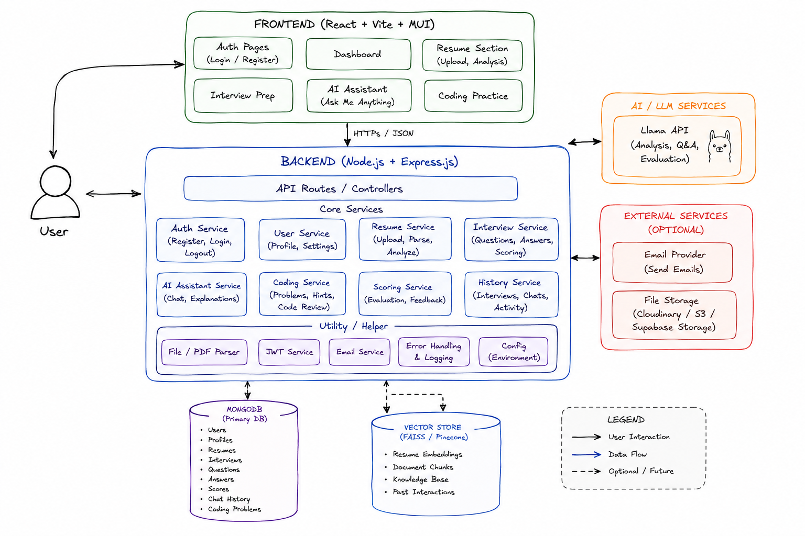

## Intelligent Comprehensive Development & Advancement Ecosystem



## Setup

### 1. Backend

```bash
cd server
cp .env
npm install
npm run dev
```

### 2. Frontend

```bash
cd client
cp .env
npm install
npm run dev
```

## Roadmap

- `feature/resume-analysis` — resume upload, PDF parsing, Llama-based ATS scoring
- `feature/interview-prep` — configurable mock interviews with AI-generated questions and feedback
- `feature/ai-assistant-coding` — AI chat + coding practice with a modular execution layer
